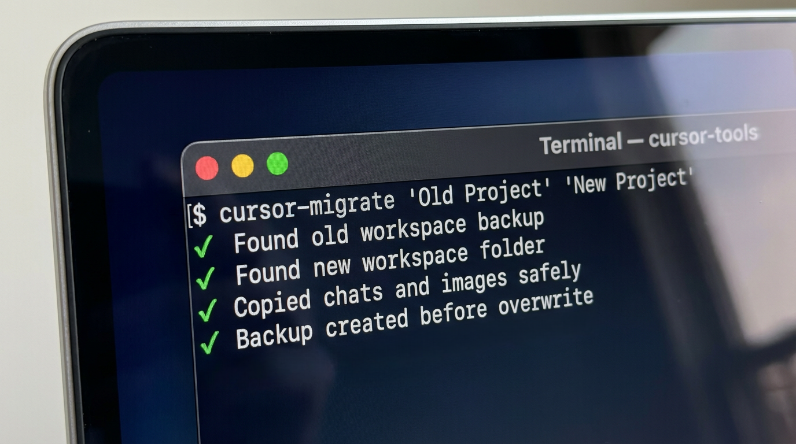

# Cursor Chat Recovery Kit



[](https://opensource.org/licenses/MIT)
[](https://www.apple.com/macos/)

## What is This?

Toolkit for recovering and migrating Cursor IDE chat history when workspace folders are renamed or lost. Never lose your valuable AI conversations again!

## The Problem It Solves

Have you ever renamed or tried to move a project folder in Cursor and suddenly lost all your chat history? This happens because Cursor creates a new workspace ID for renamed folders, leaving your chat history "orphaned" in the old workspace. Your conversations aren't actually deleted—they're just no longer linked to your project. This toolkit solves that problem and much more.

**This toolkit helps you:**
- Recover chat history after folder rename
- Back up your Cursor workspaces
- Restore from workspace corruption or data loss
- Export chat conversations to Markdown
- Explore and audit your workspace backups

## Quick Start

```bash
# Clone the repository
git clone https://github.com/vitalyis/cursor-chat-recovery-kit.git
cd cursor-chat-recovery-kit

# Set up convenient aliases
./bin/setup_aliases.sh
source ~/.zshrc

# Migrate chat history after folder rename
cursor-migrate 'Old Project Name' 'New Project Name'
```

> [!IMPORTANT]
> Always close Cursor completely before running any migration or restore operations.

## Use Cases

1. Chat History Migration — Migrate chat history when folders are renamed or moved
2. Folder Rename Recovery — Most common use case
3. Workspace Corruption Recovery — Full restore capability
4. Chat History Backup — Regular automated backups
5. Chat Export — Export conversations for documentation
6. Workspace Management — Discover and manage multiple workspaces

## Key Features

See the [detailed features and command guide](docs/FEATURES_AND_COMMANDS.md) for full explanations and examples.

**At a glance:**

&nbsp;&nbsp;&nbsp;&nbsp;✅ Chat history migration after folder rename  
&nbsp;&nbsp;&nbsp;&nbsp;✅ Automatic and manual workspace backups  
&nbsp;&nbsp;&nbsp;&nbsp;✅ Emergency recovery from corruption or loss  
&nbsp;&nbsp;&nbsp;&nbsp;✅ Chat export to Markdown for documentation  
&nbsp;&nbsp;&nbsp;&nbsp;✅ Workspace discovery and backup exploration

### Smart Chat History Migration

- Automatically find and migrate chat history between renamed folders
- Works with partial folder name matching
- Supports multiple backup versions
- One-command migration: `cursor-migrate 'OldName' 'NewName'`

### Automated Backup System

- Set up automatic backups every 4 hours
- Manual backup on demand
- Intelligent backup management (keeps last 5 snapshots)
- Complete workspace snapshots with metadata

### Emergency Recovery

- Full workspace recovery from corruption or data loss
- Workspace health diagnostics
- Multiple recovery points
- Safe restore with automatic pre-restore backups

### Chat Export & Analysis

- Export chat conversations to Markdown format
- Chat index generation for easy browsing
- Organize exports by backup timestamp and workspace
- Preserve conversation flow and context

### Workspace Discovery Tools

- List all workspaces and their details
- Find workspace IDs by folder path
- Explore backup contents
- Compare workspace sizes and dates

## Safety First

- Automatic backups before any changes  
- Cursor running check before writes  
- Workspace validation before migration  
- Timestamped backups for rollback  
- Dry-run mode for safe preview

## What's Included

- 11 executable scripts (9 shell, 2 Python)
- 6 comprehensive guides (Quick Start, Features & Commands, Migration, Backup, Recovery, Troubleshooting)
- Complete test suite for validation
- Full documentation with examples

## Documentation

- **[Migration Guide](docs/MIGRATION_GUIDE.md)** — Step-by-step migration instructions (includes how it works)
- **[Backup Guide](docs/BACKUP_GUIDE.md)** — Setting up and managing backups
- **[Emergency Recovery](docs/EMERGENCY_RECOVERY.md)** — Full recovery procedures
- **[Troubleshooting](docs/TROUBLESHOOTING.md)** — Common issues and solutions
- **[Quick Start Guide](QUICKSTART.md)** — Get up and running in 5 minutes
- **[Features and Commands](docs/FEATURES_AND_COMMANDS.md)** — Detailed feature overview and CLI reference

## Acknowledgments

Originally developed as internal tool to solve the "lost chat history after folder rename" problem. Tested and refined through real-world recovery scenarios. If you think that my repo helped you to solve the issues you struggle with, please don't be shy and sponsor :-)

## Contributing

Contributions are welcome! Please see [CONTRIBUTING.md](CONTRIBUTING.md) for guidelines.

## License

[MIT License](LICENSE) — free to use, modify, and distribute.

## Author

Made with ❤️ for the Cursor community by Vitaly Matveev, vitaly@valueadd.one
