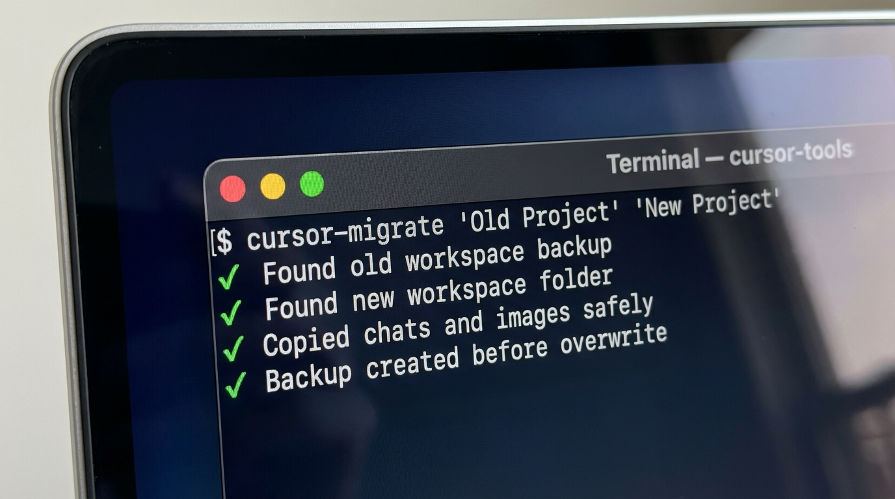

# Cursor Chat Recovery Kit



[](https://opensource.org/licenses/MIT)
[](https://www.apple.com/macos/)

Toolkit for recovering, backing up, exporting, and safely relocating Cursor IDE
workspace history when project folders are renamed, moved, or corrupted.

## What It Solves

Cursor binds chat history to workspace paths and IDs. When a folder is renamed
or moved, the old conversations usually still exist, but Cursor may stop showing
them for the new path.

This kit helps you:

- migrate chat history after a folder rename
- back up Cursor workspaces and settings
- recover from workspace corruption or data loss
- export chat conversations to Markdown
- relocate a git-backed repo without losing Cursor context

## Quick Start

```bash
git clone https://github.com/vitalyis/cursor-chat-recovery-kit.git
cd cursor-chat-recovery-kit
chmod +x bin/*.sh bin/*.py
./bin/setup_aliases.sh
source ~/.zshrc
```

## Common Workflows

### Recover Chat History After a Folder Rename

```bash
cursor-migrate 'Old Project Name' 'New Project Name'
```

### Back Up Cursor State

```bash
cursor-backup
cursor-backups
./bin/export_cursor_chats.sh
```

### Relocate a Repo Safely

```bash
cursor-relocate preflight /Users/me/OldRepo /Users/me/Projects/OldRepo
cursor-relocate move /Users/me/OldRepo /Users/me/Projects/OldRepo --apply
```

This relocation workflow:

- backs up matching `workspaceStorage` entries
- backs up matching `~/.cursor/projects/...` transcript and tool-log folders
- moves linked git worktrees before the main repo move
- recreates the old path as a symlink by default for Cursor compatibility

> [!IMPORTANT]
> Always close Cursor completely before running migration, relocation, or restore operations.

## Commands

### Migration

- `cursor-migrate 'Old' 'New'`
- `cursor-restore auto <old> <new> [backup]`
- `cursor-restore list-backups`
- `cursor-restore list-workspaces [backup]`
- `cursor-restore find <path>`

### Backup and Recovery

- `cursor-backup`
- `cursor-backups`
- `cursor-emergency diagnose`
- `cursor-emergency restore <backup>`

### Relocation

- `cursor-relocate backup <project_path>`
- `cursor-relocate preflight <old> <new>`
- `cursor-relocate move <old> <new> [--apply]`

## Repo Layout

```text
cursor-chat-recovery-kit/
├── bin/        # Executable shell + Python tools
├── docs/       # Guides and reference docs
├── tests/      # Validation scripts and test notes
├── examples/   # Example commands
├── assets/     # Images for GitHub/docs
└── *.md        # Root docs, changelog, release notes
```

## What's Included

- 12 executable scripts
  10 shell scripts
  2 Python helpers
- backup, migration, relocation, export, and emergency recovery tooling
- quick validation and broader test scripts
- release notes and changelog tracking

## Documentation

- [Quick Start](QUICKSTART.md)
- [Migration Guide](docs/MIGRATION_GUIDE.md)
- [Backup Guide](docs/BACKUP_GUIDE.md)
- [Emergency Recovery](docs/EMERGENCY_RECOVERY.md)
- [Features and Commands](docs/FEATURES_AND_COMMANDS.md)
- [Troubleshooting](docs/TROUBLESHOOTING.md)
- [Repository Structure](REPO_STRUCTURE.md)
- [Release Notes](RELEASE_NOTES.md)
- [Changelog](CHANGELOG.md)

## Version

Current release: `v2.0.0`

## License

[MIT License](LICENSE)
